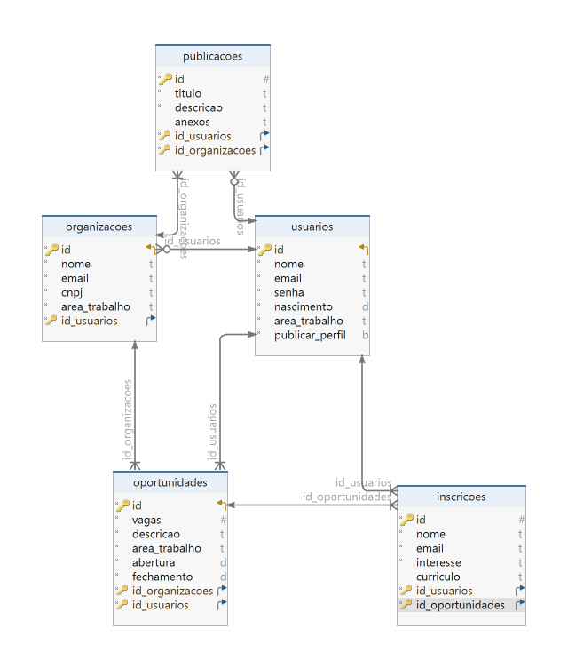

# Modelagem Banco de Dados
&nbsp;&nbsp;&nbsp;&nbsp;Um banco de dados é um sistema organizado projetado para armazenar com segurança dados e informações relacionadas a aplicações. Desse modo, cada tipo de banco de dados é construído considerando diferentes sistemas e cenários de uso, dependendo dos requisitos de escalabilidade, desempenho, consistência e outros fatores. Nesse sentido, a base de dados aqui criada, desenvolvida em PostgreeSQL e DbSchema, recolhe assim os dados dos utilizadores registados na plataforma, sendo eles os voluntários e as organizações, tendo em conta as diversas ações proporcionadas pela aplicação web desenvolvida para a ONG Parceiros Voluntários (FILHO, 2002).

&nbsp;&nbsp;&nbsp;&nbsp;Assim, começando a análise do diagrama, foram construídas cinco tabelas relacionais, sendo, a primeira delas, a de usuários, que será um espaço que irá coletar informações pessoais para o cadastro na plataforma, tanto dos voluntários como dos representantes das organizações. Isso posto, foram coletadas informações como nome, e-mail, senha, data de nascimento, área na qual o indivíduo deseja atuar e a opção de publicar ou não o seu perfil na aba de “Voluntários”, que será construída posteriormente na plataforma. Dessa forma, essa será a tabela considerada uma das mais primordiais, pois será dela que as primeiras relações serão construídas.

&nbsp;&nbsp;&nbsp;&nbsp;Em seguida, temos a tabela de organizações, relacionada com usuários através de uma chave estrangeira, tendo em vista que essas organizações serão construídas a partir de um usuário, no caso, um representante de uma organização - por isso a relação entre essas tabelas é de 0:N, a julgar que nem todo usuário pode ser representante de uma e/ou mais de uma organização. Nessa tabela, informações como nome, e-mail, CNPJ e área de atuação serão solicitadas, a julgar que o cadastro das organizações será feito a partir dela. 

&nbsp;&nbsp;&nbsp;&nbsp;Prosseguindo, temos a tabela publicações, que está conectada tanto com usuários, quanto com organizações, através de uma chave estrangeira, tendo em vista que toda publicação é feita por um usuário na plataforma e está diretamente relacionada com alguma organização, a julgar que serão publicações feitas por voluntários sobre algum trabalho realizado em alguma instituição específica. Em vista disso, as relações entre essas tabelas são de 0:N e de 1:N, pois um usuário pode postar, ou não, uma ou mais de uma publicação e uma organização pode estar associada a mais de uma publicação. Dessa maneira, dados como título, descrição e anexos serão requeridos nesse campo, a fim da construção de uma publicação rica em conteúdo.

&nbsp;&nbsp;&nbsp;&nbsp;Como penúltima tabela, foi construída a tabela de oportunidades, conectada tanto com organizações, como com usuários, através de uma chave estrangeira 1:N, pois as organizações e os usuários serão capazes de abrir oportunidades de voluntariado ao público eles mesmos, sem um limite definido previamente. À vista disso, dados sobre essa oportunidade, como quantidade de vagas, descrição, área de atuação, além da sua abertura e fechamento, são de valor inestimável. 

&nbsp;&nbsp;&nbsp;&nbsp;Por fim, temos a tabela de inscrição, diretamente conectada com oportunidades e usuários, por uma chave estrangeira 1:N, nos dois casos, a julgar que uma oportunidade aceita um número definido de inscrições, da mesma maneira que um usuário pode se inscrever mais de uma vez, considerando a oportunidade que a inscrição trará consigo. Assim sendo, essa tabela irá pedir principalmente dados do usuário, como nome, e-mail, além de uma breve descrição sobre o seu interesse na vaga e o seu currículo. Todos esses dados serão repassados para aquele por trás da organização que abriu a oportunidade, a fim de fazer uma seleção justa dos voluntários interessados.

Figura 1 - Modelo Lógico-Relacional 

Fonte: Material produzido pelo autor (2024)

&nbsp;&nbsp;&nbsp;&nbsp;Logo, esse modelo relacional de banco de dados foi construído com o objetivo de organizar como os dados serão manipulados durante o desenvolvimento da aplicação, considerando as informações e dados solicitados. Portanto, é a fim de tornar a experiência mais humana para o cliente, que tais dados são coletados, tendo em vista a importância de se conhecer não somente os indivíduos, mas também as suas ações, quando estamos falando de um desenvolvimento de uma aplicação. 

## Referências
FILHO et al. **Banco de dados relacional para cadastro, avaliação e manejo da arborização em vias públicas**. Revista Árvore, v. 26, p. 629-642, 2002. Acesso em: 05 de mai. 2024.